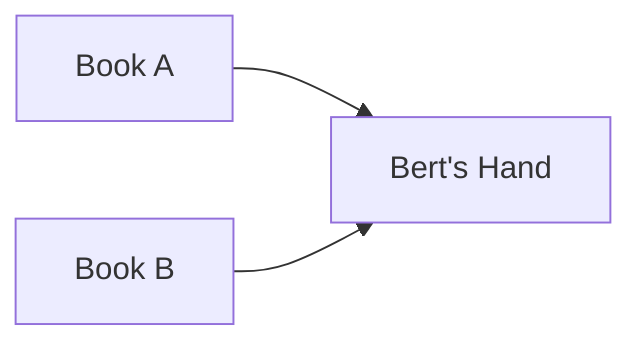
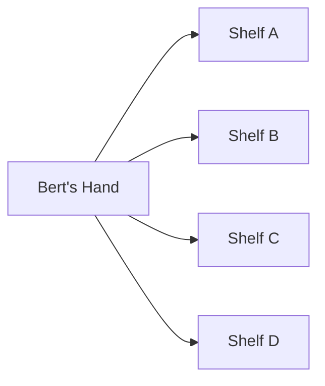

What is a multiplexer? What is a demultiplexer? Why do we build these things? And what's the correlation with the previous logic gates we have learned? I have an easy illustration to explain this.

### Illustration

Last week, Abby borrowed 2 books from the school's library.

One week later, which is today, Abby finished reading all 4 books and returned it. She met Bert the librarian and said thank you.

This is a small school, and the library is even smaller, it only has 4 shelves.

Now, Bert's task as a librarian is to put back all those 4 books to the correct shelf. But Bert is just a human being like us, he can only put back one book to one shelf at a time.

If we break it down, there are 2 main tasks here:
1. take 1 from 4 books
2. place the book to 1 of the 8 available shelves

This is the illustration of the first task.

This is the illustration of the second task.

### Multiplexer (MUX)

The task of selecting a book is a good example of a multiplexer, in which we want to select a value out of many available options and forwards it. In computers, multipliers are mostly important to select data (multipliers are also known as data selectors). It is a multiple-input, single output switch.

And as all things with computer, there has to be a way to perform this action by using only binary and logic gates.

The first step is to create a "code" to pick the books. Since there is only 2 books, one digit is sufficient. The digit variable is named S that stands for select.
- If S = 0, Book A is picked as output Y. 
- If S = 1, Book B is picked as output Y.
- Both books cannot be selected at the same time.

Using the above statements, the following equation can be written.

$$
Y = (\overline{S} \cdot A) + (S \cdot B)
$$

This is the truth table for the equation. The value for A and B is for the availability of book A and B, which are always available.

| $$S$$ | $$\overline{S}$$ | $$A$$ | $$B$$ | $$Y$$ |
|---|-------|---|---|---|
| 0 |   1   | 1 | 1 | 1 |
| 1 |   0   | 1 | 1 | 1 |

And using the equation, we can recreate the logic using:
- 1 OR gate
- 2 AND gates
- 1 NOT gate

### Demultiplexer (DEMUX)
The task of choosing which shelf is a good example of a demultiplexer, in which we want to distribute a value to a destination out of many possible destinations. In computers, demultipliers are important for data routing. It is a single-input, multiple-output switch, the opposite of multipliers.

And as in the case with multipliers, it is also entirely possible to create demultipliers using logic gates and binary system.

For our library case, we need to create another set of "code" to distribute the book to each shelf. Instead of 4 shelves, let's start small with 2 shelf. So again, the variable S will be used to represent 0 or 1.

- If S = 0, input Y (the book) will be placed on shelf A.
- If S = 1, input Y will be placed on shelf B.
Only one shelf can be selected at one time.

$$
A = (S \cdot Y)  \\
B = (\overline{S} \cdot Y)
$$

|$$Y$$| $$S$$ | $$\overline{S}$$ | $$A$$ | $$B$$ |
|---|---|-------|---|---|
|1| 0 |   1   | Y | 0 | 
|1| 1 |   0   | 0 | Y | 

And using the equation, we can recreate the logic using:
- 1 NOT gate
- 2 AND gates

### 

The 2-to-1 MUX and 1-to-2 DEMUX are a simple demonstration on how we can use combination of logic gates to perform selecting data as input and selecting destination as output.

Building on this knowledge, it is absolutely possible to build larger MUX and DEMUX such as 4, 8, 16... 1024 instead of just 2.

As an abstraction, MUX and DEMUX can be represented with this logo.